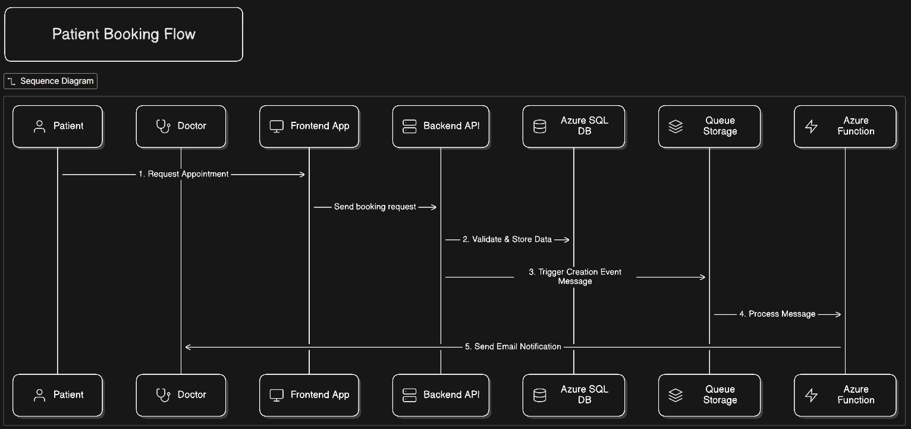
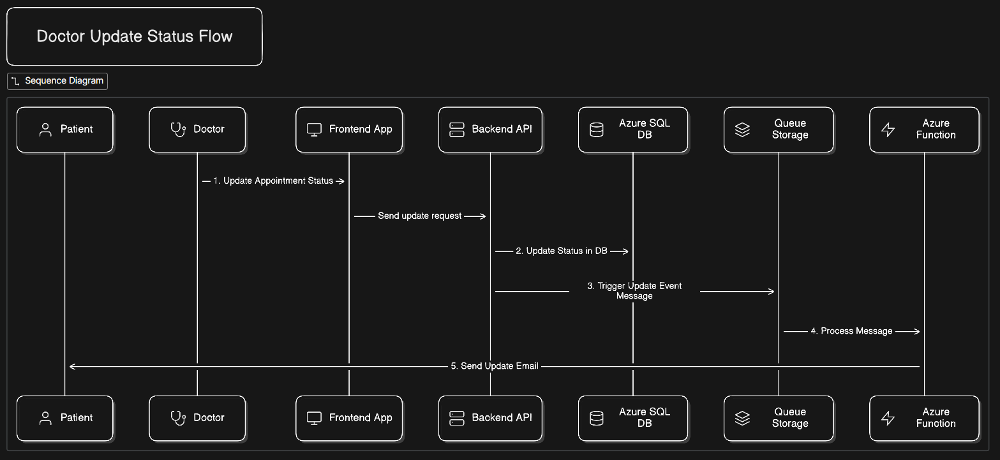

# 🩺 DoctMent – Doctor Appointment Management System

**DoctMent** is a cloud-native healthcare platform designed to streamline patient-doctor scheduling. It leverages a hybrid architecture combining **Express.js** for core API logic and **Azure Functions** for asynchronous event processing (notifications, queue handling).

---

## Tech Stack

| Domain | Technologies |
| :--- | :--- |
| **Frontend** | React (Vite), Tailwind CSS, Context API |
| **Backend** | Node.js, Express.js |
| **Serverless** | Azure Functions, Azure Queue Storage |
| **Database** | Azure SQL |

---

## System Workflows

### 1. Patient Booking Flow
Asynchronous processing of appointment requests via Azure Queue.


### 2. Doctor Status Update Flow
Event-driven updates triggering patient notifications.



---

## 📂 Project Architecture

The project adopts a structured Monorepo approach, distinctively separating core API logic from serverless background workers.

```text
DoctMent/
│
├── backend/                    # Core API & Serverless Logic
│   ├── functions/              # Azure Functions (Async Triggers)
│   ├── routes/                 # REST API Endpoints (Admin, Doctor, Auth)
│   ├── middleware/             # JWT Auth & Error Handling
│   ├── utils/                  # Services (Email, Azure Queue SDK)
│   ├── config/                 # DB & Environment Configuration
│   └── server.js               # Entry Point
│
├── frontend/                   # Client Application
│   ├── src/
│   │   ├── components/         # Reusable UI Elements
│   │   ├── context/            # Global State Management
│   │   ├── pages/              # Application Views
│   │   └── utils/              # Client-side Helpers
│   └── vite.config.js          # Bundler Config
│
└── .github/workflows/          # CI/CD Pipelines for further enhancement
```

---

## Features

- **User Authentication** (JWT-based)
- **Role Management** (Admin, Doctor, Patient)
- **Appointment Booking & Scheduling**
- **Email Notifications** for confirmations and reminders
- **Real-time Queue Processing** (Azure Functions + Queue)
- **Admin Dashboard** for managing users and appointments
- **Responsive UI** with Tailwind CSS

---

## 🛠️ Tech Stack

**Frontend:**
- React (Vite)
- Tailwind CSS
- Context API

**Backend:**
- Node.js + Express
- Azure SQL
- Azure Functions for async processing
- Nodemailer for email notifications

---

## ⚙️ Installation & Setup
```bash
1 git clone https://github.com/mohith0407/doctor-appointment-using-azure.git
cd doctment
2️ Backend Setup
cd backend
npm install
cp .env.example .env   # Configure environment variables
npm run dev            # Start in development mode
3️ Frontend Setup
cd frontend
npm install
npm run dev            # Start Vite development server
